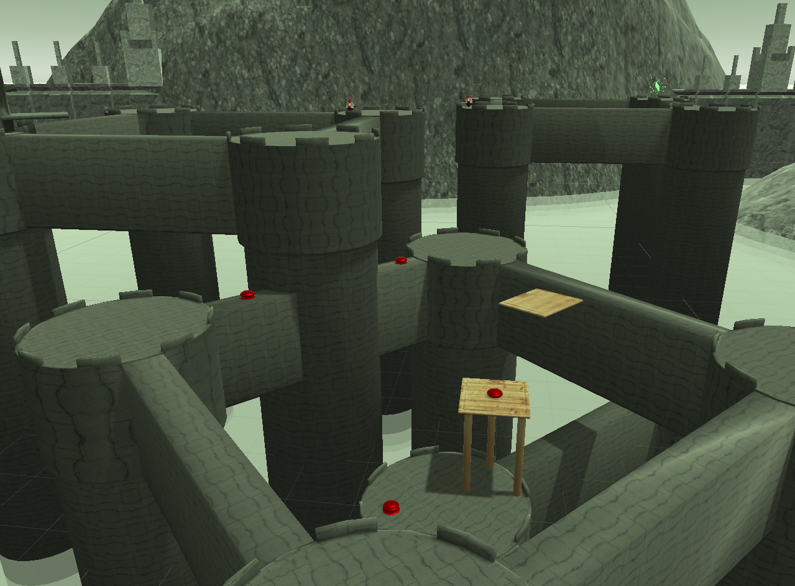
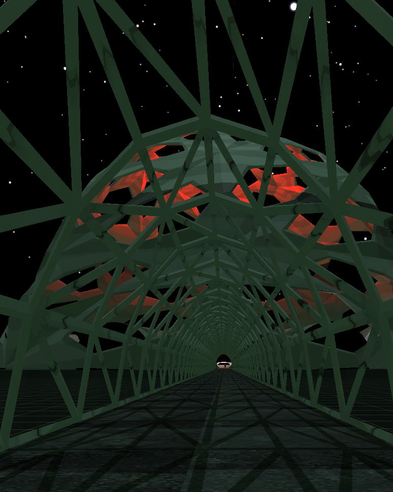
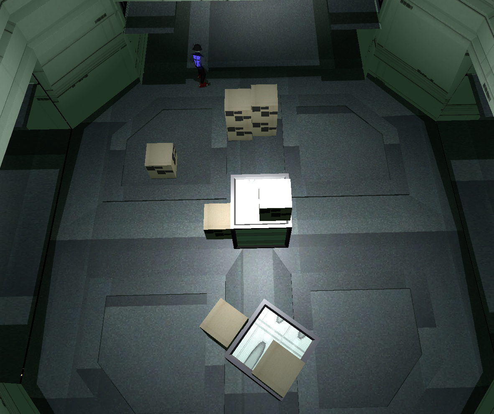
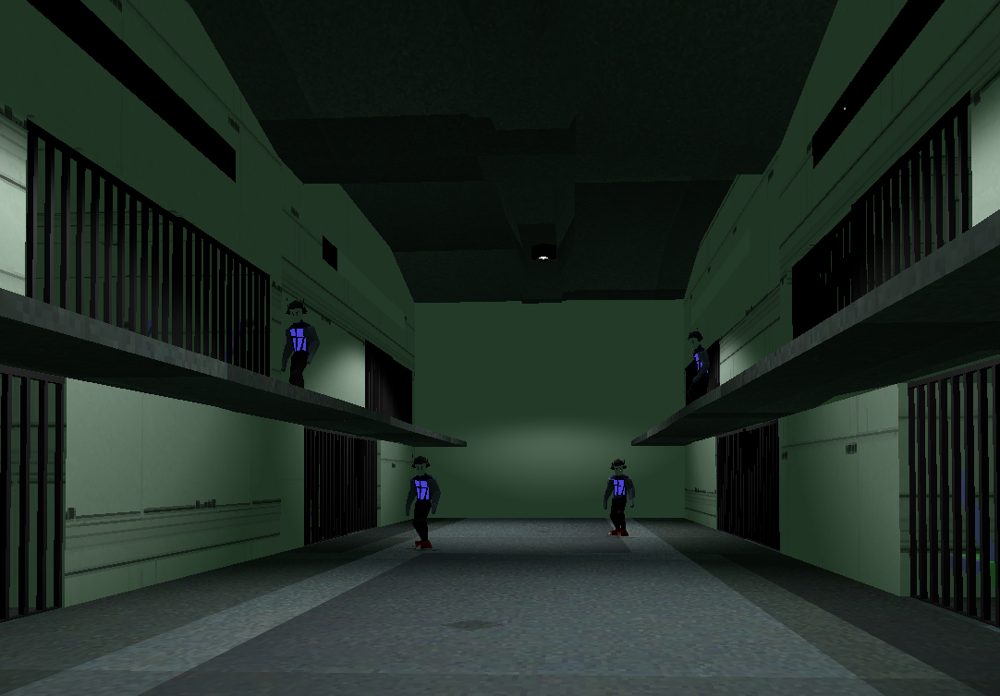
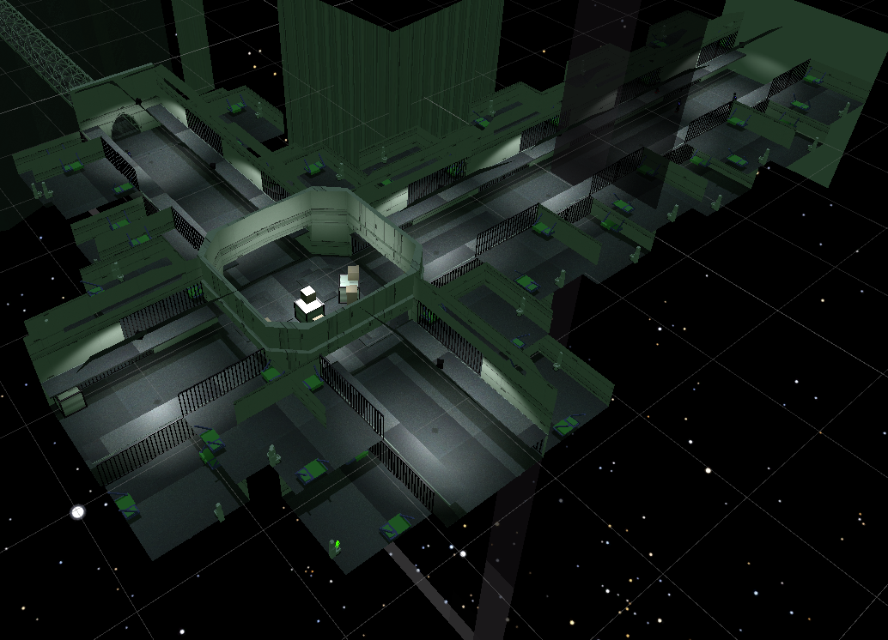
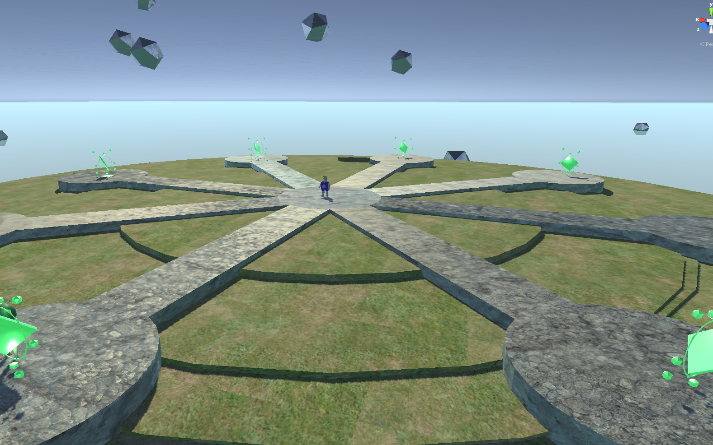
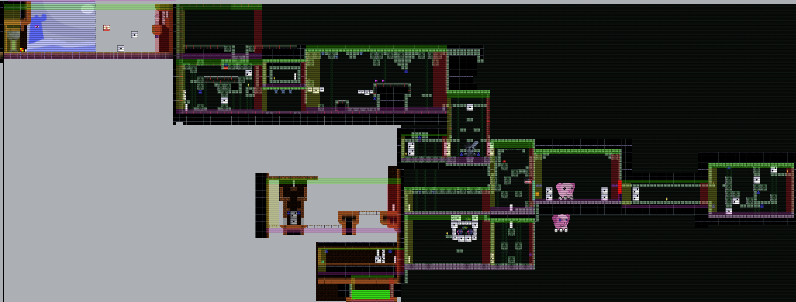

## Level Design
I've worked with a wide variety of different games to create engaging levels that feed information to the player in a way that keeps them connected to the experience. 
Working in both 2D games and 3D, the different requirements for quality in each are understood by me. 
### 3D Level Design

 
<iframe width="560" height="315" src="https://www.youtube.com/embed/UztvuW_BeNQ" frameborder="0" allow="accelerometer; autoplay; encrypted-media; gyroscope; picture-in-picture" allowfullscreen></iframe>

### 2D Level Design
 
<iframe width="560" height="315" src="https://www.youtube.com/embed/NfX1IK3OsSQ" frameborder="0" allow="accelerometer; autoplay; encrypted-media; gyroscope; picture-in-picture" allowfullscreen></iframe>

[home](index.md) 
